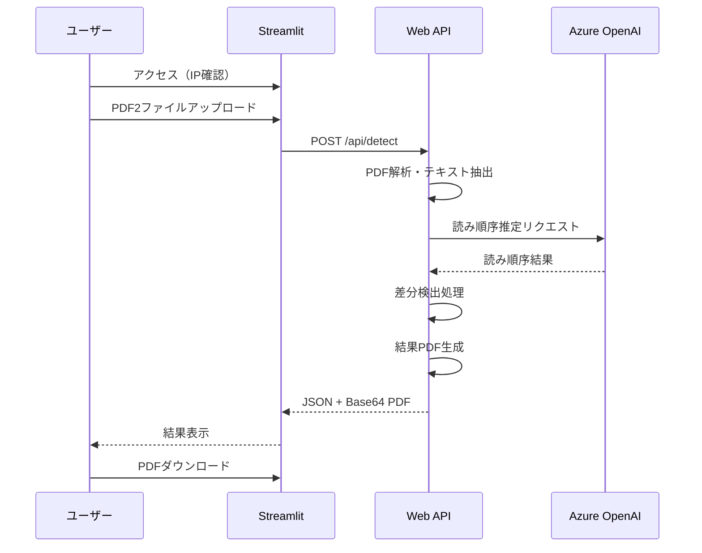

# PDF差分検出システム - アーキテクチャ（案）

## システム概要

### アーキテクチャ構成（モノリシック構成）
```mermaid
graph TB
    subgraph "利用者"
        U[ユーザー<br/>IP制限付きアクセス]
    end

    subgraph "Azure App Service"
        subgraph "単一Dockerコンテナ"
            WEB[Streamlit Web App<br/>Python 3.11<br/>Port: 8501]
            API[PDF差分検出API<br/>内部通信<br/>Port: 8000]
        end
    end

    subgraph "Azure OpenAI Service"
        LLM[GPT-4<br/>読み順序推定]
    end

    subgraph "GitHub"
        REPO[ソースコード]
        GA[GitHub Actions]
    end

    U -->|HTTPS| WEB
    WEB -->|localhost:8000| API
    API -->|API Call| LLM
    REPO -->|Push| GA
    GA -->|Deploy| Azure App Service
```

**注意**: モジュラーモノリシック構成を採用。横山さんのDockerイメージをベースに統合。

## 技術スタック

| レイヤー | 技術 | 担当 | 備考 |
|---------|------|------|------|
| **フロントエンド** | Streamlit 1.35+ | 杉山 | Python製Webフレームワーク |
| **バックエンド** | Web API（FastAPI） | 横山さん | 内部API（localhost:8000） |
| **PDF処理** | PyMuPDF | 横山さん | 実装済み |
| **日本語処理** | MeCab | 横山さん | 実装済み |
| **LLM** | Azure OpenAI Service | 横山さん | GPT-4使用 |
| **ホスティング** | Azure App Service | 杉山 | B1インスタンス（単一コンテナ） |
| **CI/CD** | GitHub Actions | 杉山 | 自動デプロイ |

## データフロー



## API仕様（7月末確定予定）

### エンドポイント（仮）
```
POST /api/detect
Content-Type: multipart/form-data
```

### リクエスト
- `file1`: PDFファイル（必須、最大50MB）
- `file2`: PDFファイル（必須、最大50MB）

### レスポンス（仮）
```json
{
  "status": "success",
  "processing_time": 5.2,
  "summary": {
    "additions": 10,
    "deletions": 5,
    "modifications": 3
  },
  "result_pdf": "base64_encoded_pdf_string",
  "error_code": null,
  "message": "処理が正常に完了しました"
}
```

### エラーレスポンス（仮）
```json
{
  "status": "error",
  "processing_time": 0.5,
  "summary": null,
  "result_pdf": null,
  "error_code": "FILE_TOO_LARGE",
  "message": "ファイルサイズが50MBを超えています"
}
```

## セキュリティ設計

### アクセス制御
- **IP制限**: App Serviceのアクセス制限機能で実装
- **許可IPリスト**: 顧客環境のIPアドレスのみ許可
- **認証**: なし（PoC版のため）

### 通信セキュリティ
- **HTTPS**: App Service標準SSL証明書使用
- **API間通信**: パブリックエンドポイント経由（HTTPSで保護）
  - Container InstancesのネットワークアクセスをApp ServiceのIPアドレスのみに制限
  - APIキー認証による追加のセキュリティ層

### 機密情報管理
- **APIキー**: App Service環境変数に格納
- **接続文字列**: Key Vaultは使用せず、環境変数で管理

## インフラ構成

### リソース一覧（モノリシック構成）
| リソース | SKU/サイズ | 用途 | 月額コスト |
|---------|-----------|------|------------|
| App Service Plan | B1 | モノリシックアプリホスティング | ¥5,000 |
| App Service | - | Streamlit + API統合アプリ | - |
| Storage Account | Standard LRS | 一時ファイル保存 | ¥500 |

**削減効果**: Container Instances不要により月額¥2,000削減

### ネットワーク構成
- パブリックアクセス（IP制限付き）
- 内部通信のみ（CORS設定不要）
- シンプルな構成

## デプロイメント設計

### CI/CDパイプライン
```yaml
name: Deploy Streamlit to Azure

on:
  push:
    branches: [main]

jobs:
  deploy:
    runs-on: ubuntu-latest
    steps:
      - uses: actions/checkout@v4
      - uses: azure/login@v2
        with:
          creds: ${{ secrets.AZURE_CREDENTIALS }}
      - uses: azure/webapps-deploy@v3
        with:
          app-name: pdf-diff-poc-web
          publish-profile: ${{ secrets.AZURE_WEBAPP_PUBLISH_PROFILE }}
```

### 環境変数
```bash
# App Service設定
AZURE_OPENAI_ENDPOINT=https://xxx.openai.azure.com/
AZURE_OPENAI_API_KEY=***
API_URL=http://localhost:8000  # 内部通信
USE_MOCK_API=false  # 本番環境
```

## 制約事項

### 機能制約
- 同時処理数: 10リクエストまで
- ファイルサイズ: 最大50MB/ファイル
- 処理時間: 最大60秒でタイムアウト
- ファイル保持: 処理完了後即削除

### 非機能要件
- 可用性: 99%（PoC版）
- 応答時間: 30ページPDFで60秒以内
- 同時ユーザー数: 最大10名

## コスト試算（モノリシック構成）

| 項目 | 月額費用 |
|------|----------|
| App Service (B1) | ¥5,000 |
| ~~Container Instances~~ | ~~¥2,000~~ → ¥0 |
| Storage | ¥500 |
| Azure OpenAI | 従量課金 |
| **合計** | **¥5,500〜** |

**コスト削減**: 月額¥2,000削減（Container Instances不要）

## 今後の拡張性

### 本番化時の考慮事項
1. **認証追加**: Azure AD B2C統合
2. **スケーラビリティ**: App Service自動スケール
3. **監視**: Application Insights導入
4. **データ保持**: Blob Storageでの結果保存
5. **非同期処理**: Azure Functionsでのバックグラウンド処理

## モノリシックアーキテクチャの利点

1. **シンプルな構成**: 単一コンテナで全機能を提供
2. **CORS不要**: 同一オリジンでの通信
3. **コスト削減**: Container Instances不要で月額¥2,000削減
4. **運用容易性**: 監視ポイントの削減
5. **パフォーマンス**: ネットワークレイテンシなし

## 開発・デプロイ戦略

### 開発時（7月）
- foundation/web: モックAPIで独立開発
- apps/: 横山さんが独立開発
- 相互に影響なし

### 統合時（8月）
- 横山さんのDockerイメージをベースに統合
- 単一のDockerfileで両機能を包含
- Azure App Serviceにデプロイ

このアーキテクチャにより、8月20日までにPoC版の本番稼働を実現します。

---

*更新日: 2025年7月10日*
*モジュラーモノリシック構成に変更*