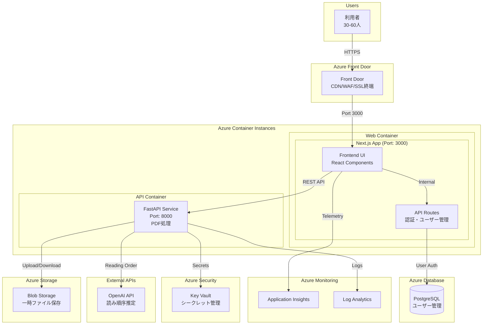
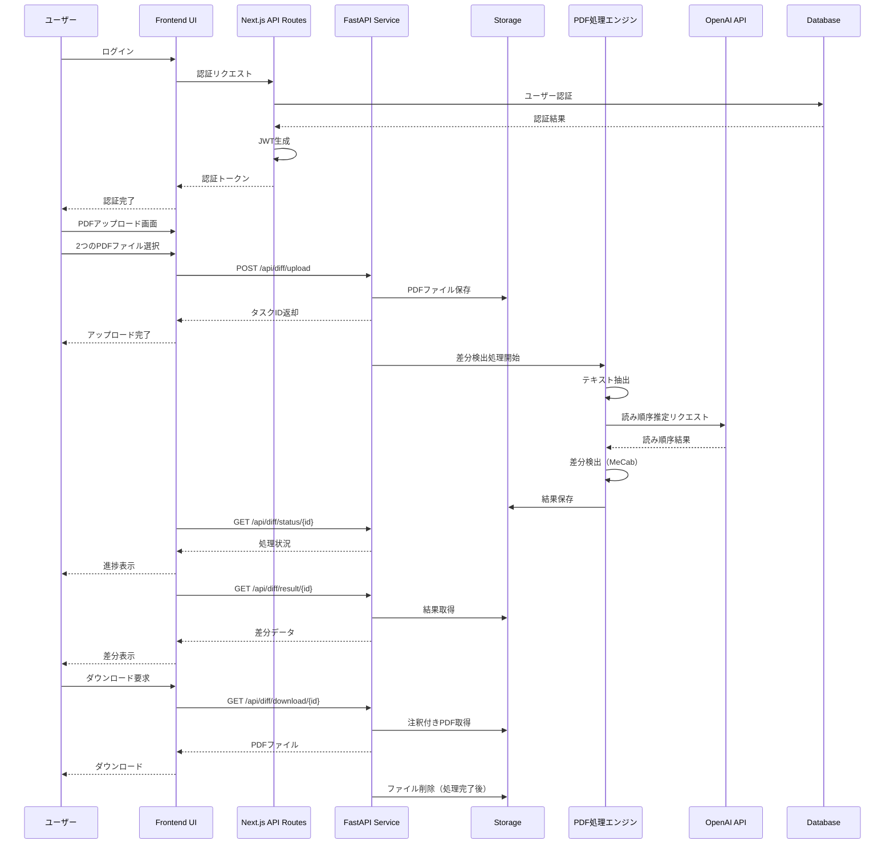
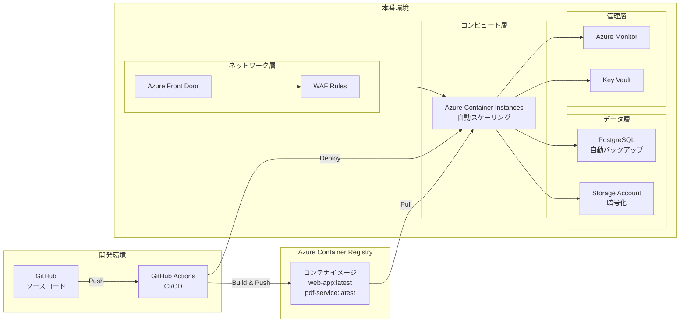
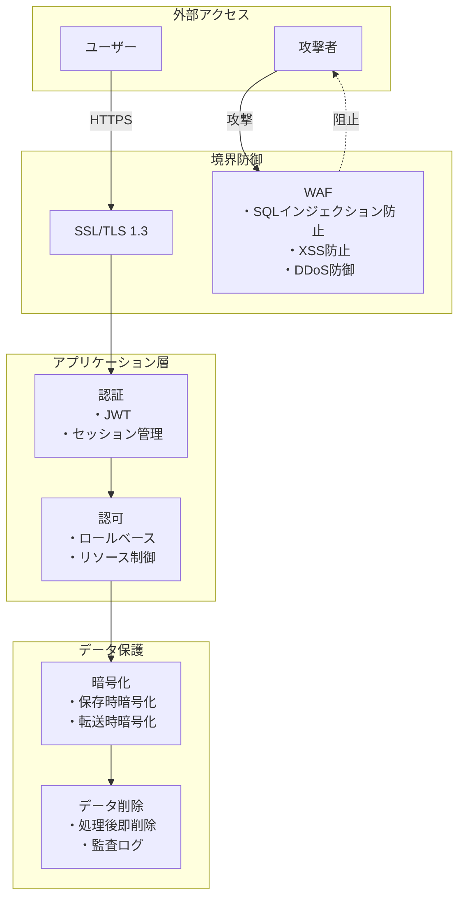
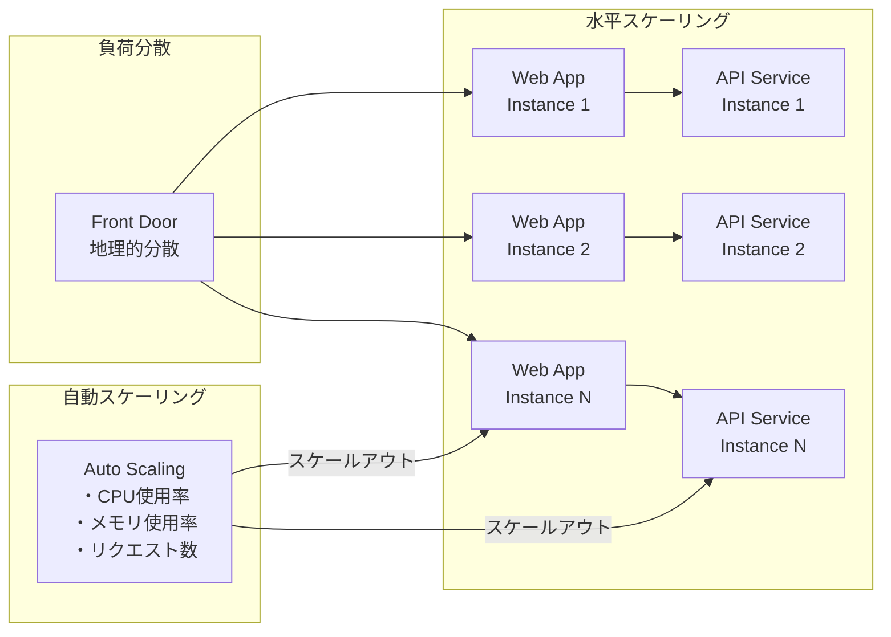
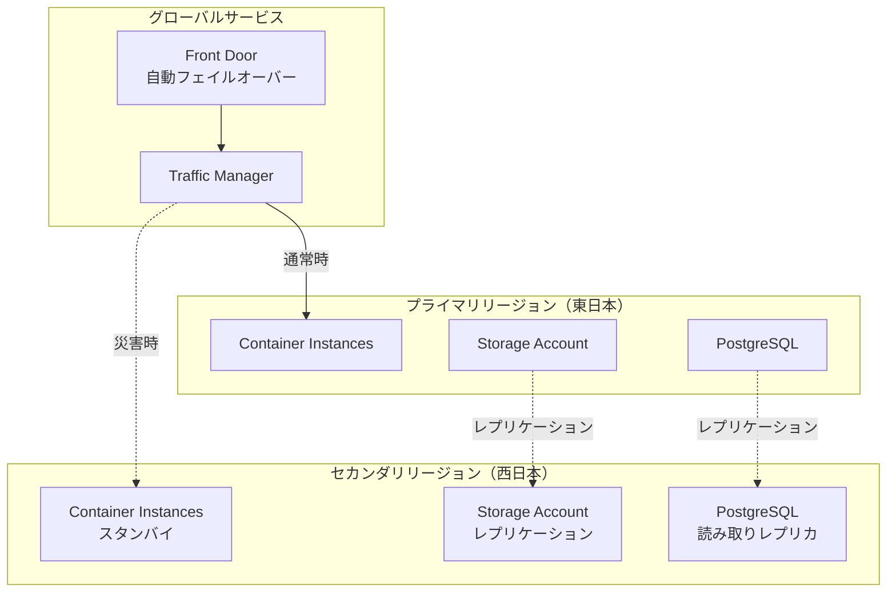
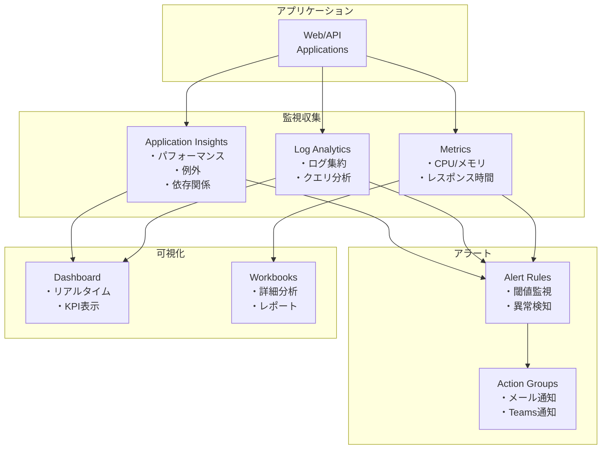
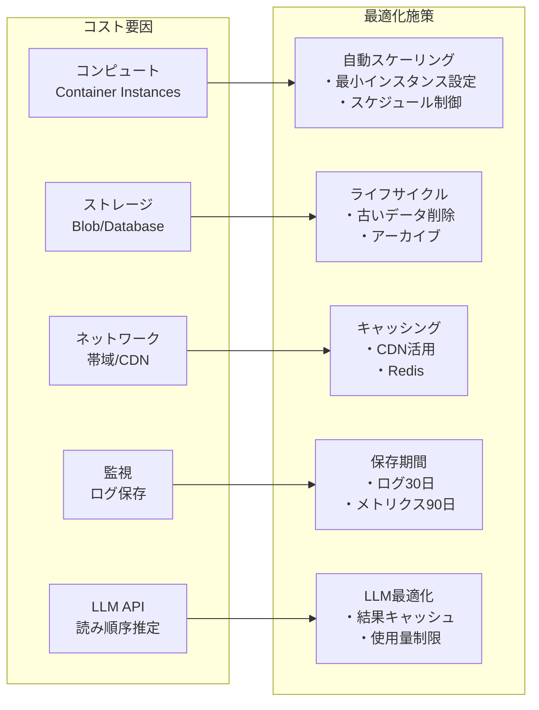

# PDF差分検出システム - システムアーキテクチャ

## システム全体構成図

### アーキテクチャ設計の考慮点
- **Next.js フルスタック構成**: Next.jsのAPI Routesを活用し、フロントエンドとユーザー認証API機能を1つのコンテナに統合
- **責任分離**: PDF処理は専用のFastAPIサービスで処理し、認証・ユーザー管理はNext.js API Routesで処理
- **セキュリティ**: フロントエンドUIは直接データベースにアクセスせず、Next.js API Routesを経由

## データフロー図

## インフラストラクチャ構成

## セキュリティアーキテクチャ

## スケーラビリティ設計

## 災害復旧（DR）計画

## 監視・運用アーキテクチャ

## コスト最適化アーキテクチャ

## 技術スタック一覧

| レイヤー | 技術/サービス | 用途 | バージョン | 備考 |
|---------|--------------|------|------------|------|
| **フロントエンド（杉山さん担当）** |
| フロントエンド | Next.js 15, React 19, TypeScript 5.5+ | フルスタックフレームワーク | 2025年7月最新安定版 | 新規選定（API Routes含む） |
| スタイリング | Tailwind CSS 3.4+ | CSSフレームワーク | 最新安定版 | 新規選定 |
| 状態管理 | Zustand 4.5+ | クライアント状態管理 | 最新安定版 | 新規選定 |
| JavaScript実行環境 | Node.js 22 LTS | 実行環境 | LTS | 新規選定 |
| PDF表示 | PDF.js 4.0+ | ブラウザPDF表示 | 最新安定版 | 新規選定 |
| **バックエンド（横山さん担当）** |
| バックエンド | FastAPI, Python 3.11 | APIサーバー | pyproject.toml準拠 | 既存選定済み |
| PDF処理 | PyMuPDF ^1.23.8 | PDF解析 | pyproject.toml準拠 | 既存選定済み |
| 日本語処理 | mecab-python3 ^1.0.6 | 形態素解析 | pyproject.toml準拠 | 既存選定済み |
| 数値計算 | numpy ^1.24.0 | 数値処理 | pyproject.toml準拠 | 既存選定済み |
| LLM API | OpenAI API | 読み順序推定 | GPT-4 Turbo | 暫定選定※5 |
| **インフラ（杉山さん担当）** |
| コンテナ | Docker 26.0+, Azure Container Instances | アプリケーション実行環境 | 最新安定版 | 新規選定 |
| CDN/WAF | Azure Front Door | コンテンツ配信・セキュリティ | - | 新規選定 |
| ストレージ | Azure Blob Storage | ファイル保存 | - | 一時保存のみ※2 |
| データベース | Azure Database for PostgreSQL 16+ | ユーザー管理 | PostgreSQL 16推奨 | 新規選定 |
| 認証 | JWT (RFC 7519) | ユーザー認証 | 標準仕様 | 新規選定 |
| 監視 | Application Insights, Log Analytics | パフォーマンス監視 | - | ログ保持期間未定※4 |
| CI/CD | GitHub Actions | 自動デプロイ | - | 新規選定 |
| IaC | Terraform 1.8+ | インフラ管理 | 最新安定版 | 新規選定 |

### 未確定要素による影響
※1: 画像・表・グラフの差分検出は未定（質問No.2）
※2: ファイル保存要件は不要と確定（質問No.6）
※3: 予算（質問No.9）とシステム稼働率（質問No.12）による
※4: ログ管理要件（質問No.13）による
※5: LLM APIは暫定でOpenAI GPT-4 Turboを想定、Azure OpenAI Serviceの検討も必要