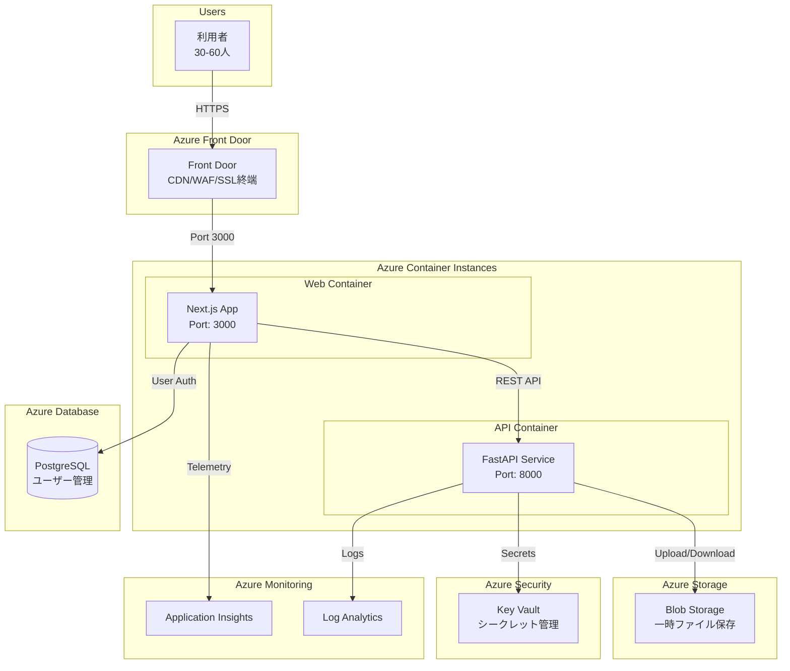
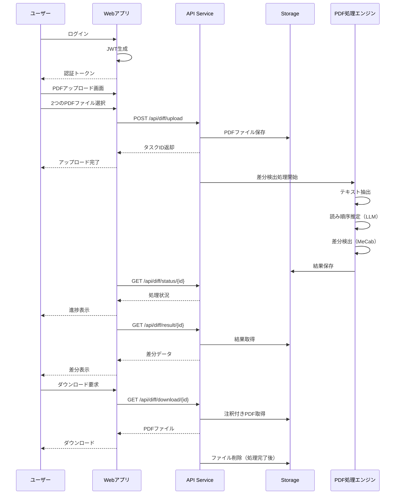
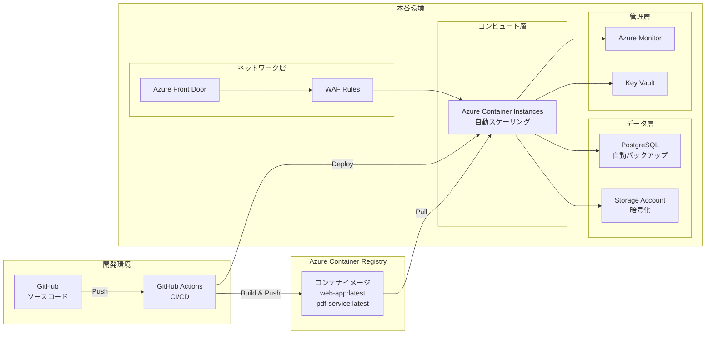
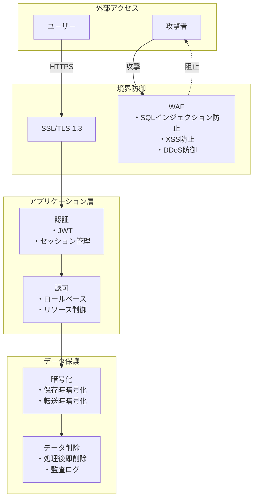
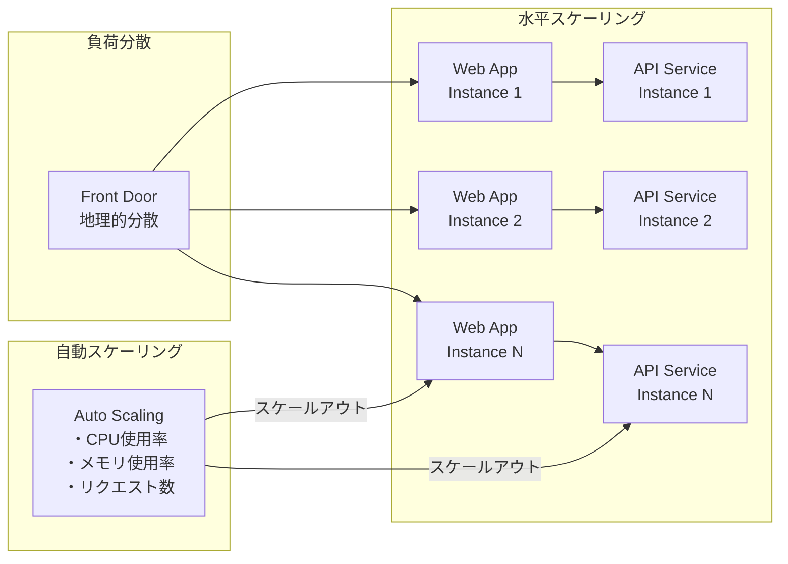
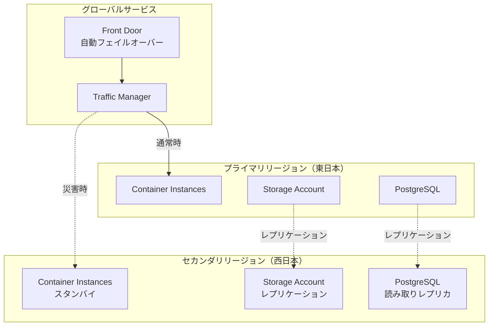
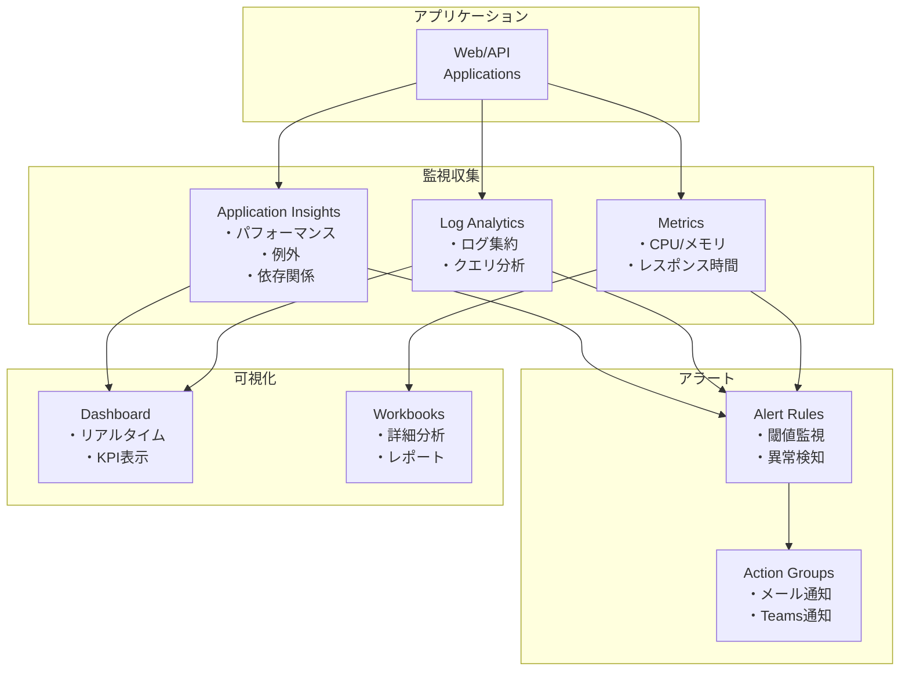
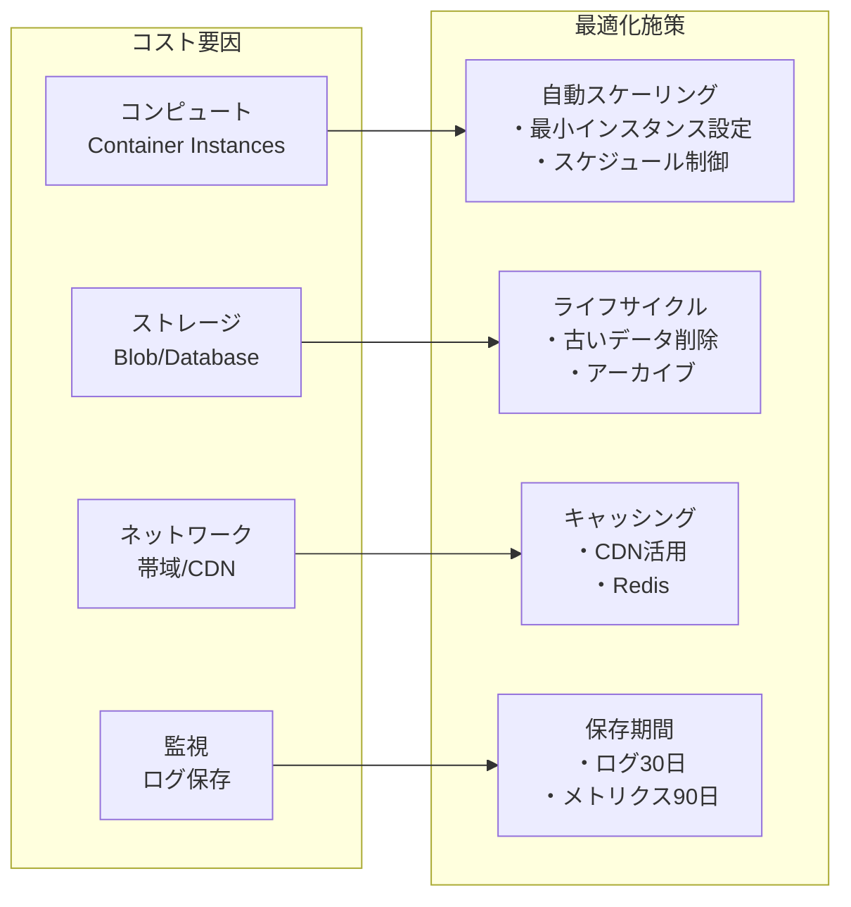

# PDF差分検出システム - システムアーキテクチャ

## システム全体構成図

## データフロー図

## インフラストラクチャ構成

## セキュリティアーキテクチャ

## スケーラビリティ設計

## 災害復旧（DR）計画

## 監視・運用アーキテクチャ

## コスト最適化アーキテクチャ

## 技術スタック一覧

| レイヤー | 技術/サービス | 用途 | 備考 |
|---------|--------------|------|------|
| フロントエンド | Next.js 14, React 18, TypeScript | UIフレームワーク | 確定 |
| スタイリング | Tailwind CSS | CSSフレームワーク | 確定 |
| 状態管理 | Zustand | クライアント状態管理 | 確定 |
| バックエンド | FastAPI, Python 3.11 | APIサーバー | 確定 |
| PDF処理 | PyMuPDF, PDF.js | PDF解析・表示 | テキストPDFのみ対応※1 |
| 日本語処理 | MeCab | 形態素解析 | 確定 |
| コンテナ | Docker, Azure Container Instances | アプリケーション実行環境 | 確定 |
| CDN/WAF | Azure Front Door | コンテンツ配信・セキュリティ | 確定 |
| ストレージ | Azure Blob Storage | ファイル保存 | 一時保存のみ※2 |
| データベース | Azure Database for PostgreSQL | ユーザー管理 | スペック要調整※3 |
| 認証 | JWT | ユーザー認証 | 確定 |
| 監視 | Application Insights, Log Analytics | パフォーマンス監視 | ログ保持期間未定※4 |
| CI/CD | GitHub Actions | 自動デプロイ | 確定 |
| IaC | Terraform | インフラ管理 | 確定 |

### 未確定要素による影響
※1: 画像・表・グラフの差分検出は未定（質問No.2）
※2: ファイル保存要件は不要と確定（質問No.6）
※3: 予算（質問No.9）とシステム稼働率（質問No.12）による
※4: ログ管理要件（質問No.13）による