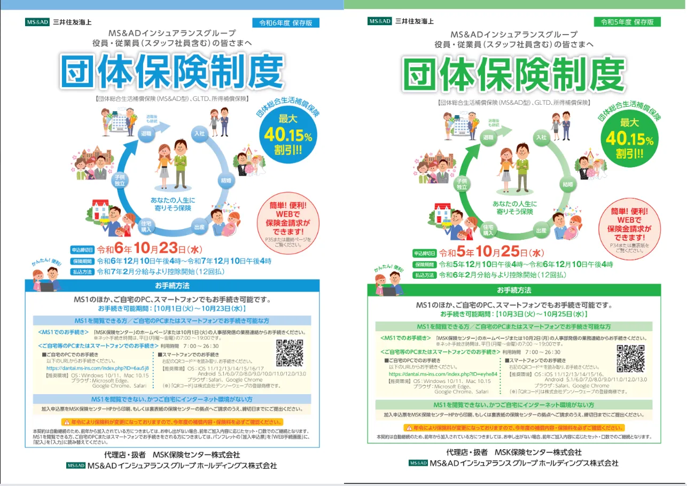
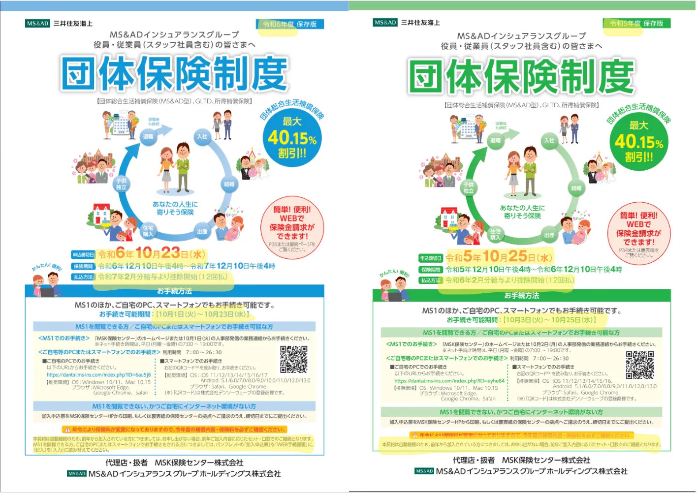

# PDF差分検出システム 要望定義書

## 本ドキュメントの目的
本ドキュメントは、PDF差分検出システムについて、どのようなシステムをなぜ開発するのかの大枠の認識を合わせるための資料です。

## 1. プロジェクトの目的

### 1.1 背景
現在、契約書・仕様書・ガイドラインなど、類似したPDFドキュメントの差分確認作業を人手で行っており、以下の課題が存在します。

- **作業効率の問題**: 目視による確認作業に多大な時間とコストがかかっている
- **品質の問題**: 見落としによるミスが発生し、一文字の違いが重大な影響を及ぼす可能性がある

### 1.2 目的
PDF間の差分検出を自動化し、差分内容をPDFに直接書き込むことで、確認作業の効率化とミス防止を実現する。

## 2. 対象範囲

### 2.1 対象ファイル形式
- PDF・Word・Pptx（優先はPDF）

## 3. 機能要件

### 3.1 基本機能
1. **ファイルアップロード機能**
   - 比較対象となる2つのPDFファイルをアップロード

2. **差分検出機能**
   - PDFファイル間の差分を自動検出
   - 検出対象の詳細：テキスト・表・レイアウト・画像（優先はテキスト・表・レイアウト）

3. **差分表示機能**
   - 検出した差分箇所をハイライト表示
   - 差分内容を注釈として追加

4. **ファイルダウンロード機能**
   - 差分が注釈として追加されたPDFファイルをダウンロード

## 4. 業務フロー

### 4.1 現状フロー（As-Is）
1. 担当者が2つのPDFファイルを目視で比較
2. 差分があれば手作業でマーカーで線を引く・記録
3. 完了したPDFを関係者に配布

#### 具体例
**手順1: 目視での比較作業**

*2つのPDFを並べて目視で差分を確認している様子*

**手順2: 手作業でのマーカー記入**

*差分箇所に手作業でハイライトを追加した後の状態*

### 4.2 改善後フロー（To-Be）
1. ユーザーがPDFを2ファイルアップロード
2. システムが自動で差分を検出
3. 差分箇所に自動で注釈を挿入したPDFを生成
4. ユーザーが注釈付きPDFをダウンロードし、関係者に共有

#### メリット
- **作業時間の削減**: 手作業での確認・マーカー記入が不要
- **見落としの防止**: システムが自動で全ての差分を検出
- **品質の均一化**: 担当者によるばらつきがない

## 5. 利用環境

### 5.1 システム形態
- Webアプリケーション

### 5.2 想定利用規模
- **利用者数**: 30〜60人
- **同時アクセス数**: 最大3人、（合併後の本番開発になると人数が増える可能性がある）
- **利用頻度**: 1日あたり約30回の差分チェック

## 6. 非機能要件

### 6.1 セキュリティ要件
- **📌 現在問い合わせ中**: 機密情報の取り扱い有無とセキュリティ対策の必要性

### 6.2 データ保存要件
- アップロードファイルおよび差分結果の保存は不要（処理完了後に削除）

### 6.3 性能要件
- 処理時間の目標値: 5分以内（ファイルサイズに関わらず）

## 7. 制約事項
（現時点では特になし）

## 8. スケジュール
- **希望納期**: 2025年8月末

## 9. 備考
- 本書に記載の「📌 現在問い合わせ中」の項目については、別途「質問事項管理表」にて管理し、回答が得られ次第、本書を更新する。

---
**更新履歴**
- 2025-06-19: 初版作成