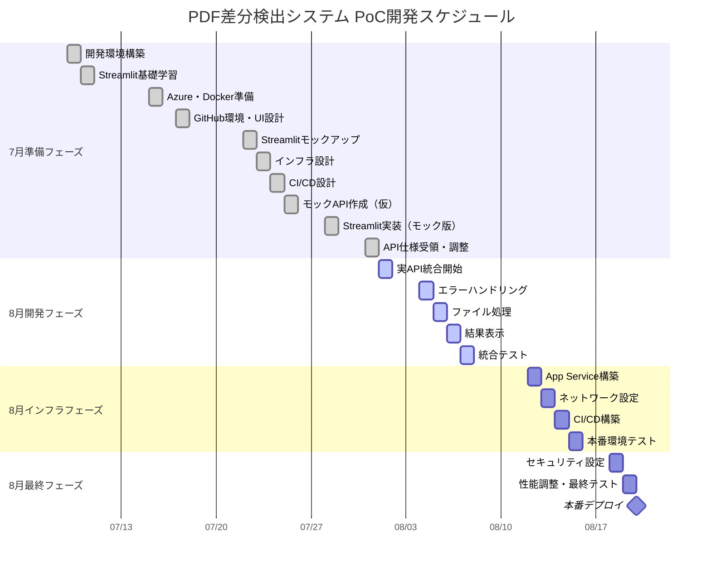

# PDF差分検出システム - ガントチャート（案）

## プロジェクト期間：2025年7月9日（水）～8月20日（水）



## マイルストーン

| 日付 | マイルストーン | 進捗バー |
|------|----------------|---------|
| 7/31（木） | API仕様確定（仮FastAPI） | ░░░░░░░░░░ 0% |
| 8/7（木） | Streamlit開発完了 | ░░░░░░░░░░ 0% |
| 8/15（金） | Azure環境構築完了 | ░░░░░░░░░░ 0% |
| 8/20（水） | **本番稼働開始** | ░░░░░░░░░░ 0% |

## 作業内訳

### 7月（30時間）

```
週次内訳：
- 第2週（7/9-11）: 6時間
- 第3週（7/14-18）: 6時間  ※7/14,16,18は除外
- 第4週（7/21-25）: 12時間 ※7/21は祝日
- 第5週（7/28-31）: 6時間  ※7/29-30は除外
```

### 8月（100時間）

```
週次内訳：
- 第1週（8/1-8）: 40時間
- 第2週（8/11-15）: 32時間 ※8/11は祝日
- 第3週（8/18-20）: 16時間
- 予備時間: 12時間
```

## クリティカルパス

以下の作業がプロジェクト完了に直接影響：

1. **7/31 API仕様受領** → 8/1 実API統合開始
2. **8/7 統合テスト完了** → 8/12 インフラ構築開始
3. **8/15 本番環境テスト** → 8/18 最終調整
4. **8/20 本番デプロイ**

## リスク対応期間

- **API仕様変更対応**: 8/1-8/4（3日間）
- **統合問題対応**: 8/5-8/7（3日間）
- **インフラ問題対応**: 8/12-8/15（4日間）
- **最終調整**: 8/18-8/19（2日間）

## 注意事項

- **FastAPI使用は仮決定**: 7月末に横山さんが最終決定
- **7月の稼働制限**: 指定された除外日を考慮
- **祝日考慮**: 7/21（海の日）、8/11（山の日）

---

*作成日: 2025年7月8日*
*このガントチャートはスケジュール案に基づいています*