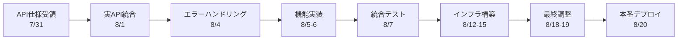

# PDF差分検出システム - WBS（作業分解構造）案

## プロジェクト概要
- **期間**: 2025年7月9日（水）～8月20日（水）
- **総工数**: 130時間
- **担当**: 杉山（フロントエンド・インフラ）

## WBS構造

```
1. PDF差分検出システムPoC開発
├── 1.1 準備フェーズ（7月：30時間）
│   ├── 1.1.1 開発環境整備（6時間）
│   │   ├── 1.1.1.1 Python環境構築 - 7/9（3h）
│   │   └── 1.1.1.2 Streamlit基礎学習 - 7/10（3h）
│   │
│   ├── 1.1.2 基盤準備（6時間）
│   │   ├── 1.1.2.1 Azure環境準備 - 7/15（3h）
│   │   └── 1.1.2.2 GitHub・Docker環境 - 7/17（3h）
│   │
│   ├── 1.1.3 設計・プロトタイプ（12時間）
│   │   ├── 1.1.3.1 UI設計・モックアップ - 7/22（3h）
│   │   ├── 1.1.3.2 インフラ設計 - 7/23（3h）
│   │   ├── 1.1.3.3 CI/CD設計 - 7/24（3h）
│   │   └── 1.1.3.4 モックAPI作成 - 7/25（3h）
│   │
│   └── 1.1.4 統合準備（6時間）
│       ├── 1.1.4.1 Streamlit実装（モック） - 7/28（3h）
│       └── 1.1.4.2 API仕様受領・調整 - 7/31（3h）
│
├── 1.2 開発フェーズ（8月第1週：40時間）
│   ├── 1.2.1 API統合（16時間）
│   │   ├── 1.2.1.1 実API接続実装 - 8/1（8h）
│   │   └── 1.2.1.2 エラーハンドリング - 8/4（8h）
│   │
│   └── 1.2.2 機能実装（24時間）
│       ├── 1.2.2.1 ファイル処理機能 - 8/5（8h）
│       ├── 1.2.2.2 結果表示機能 - 8/6（8h）
│       └── 1.2.2.3 統合テスト - 8/7（8h）
│
├── 1.3 インフラフェーズ（8月第2週：32時間）
│   ├── 1.3.1 Azure環境構築（16時間）
│   │   ├── 1.3.1.1 App Service構築 - 8/12（8h）
│   │   └── 1.3.1.2 ネットワーク設定 - 8/13（8h）
│   │
│   └── 1.3.2 自動化構築（16時間）
│       ├── 1.3.2.1 CI/CD実装 - 8/14（8h）
│       └── 1.3.2.2 本番環境テスト - 8/15（8h）
│
└── 1.4 最終フェーズ（8月第3週：16時間）
    ├── 1.4.1 セキュリティ実装 - 8/18（8h）
    ├── 1.4.2 性能調整・最終テスト - 8/19（8h）
    └── 1.4.3 本番デプロイ - 8/20（時間外）
```

## 成果物一覧

### 1.1 準備フェーズ成果物
- [ ] 開発環境（VS Code、Python、Docker）
- [ ] Streamlit学習完了証跡
- [ ] Azure/GitHubアカウント設定
- [ ] UI設計書（画面遷移図）
- [ ] インフラ設計書
- [ ] CI/CD設計書
- [ ] モックAPI（仮FastAPI）
- [ ] Streamlitプロトタイプ

### 1.2 開発フェーズ成果物
- [ ] API統合済みStreamlitアプリ
- [ ] エラーハンドリング実装
- [ ] ファイルアップロード機能
- [ ] 結果表示・ダウンロード機能
- [ ] 統合テスト結果

### 1.3 インフラフェーズ成果物
- [ ] Azure App Service環境
- [ ] ネットワーク設定（IP制限）
- [ ] GitHub Actions ワークフロー
- [ ] 自動デプロイ設定
- [ ] E2Eテスト結果

### 1.4 最終フェーズ成果物
- [ ] HTTPS設定
- [ ] セキュリティ設定完了
- [ ] 性能テスト結果
- [ ] **本番稼働システム**

## 依存関係



## リスク項目と対策

| WBS番号 | リスク | 対策 |
|---------|--------|------|
| 1.1.4.2 | API仕様の遅延 | モックで事前準備 |
| 1.2.1.1 | API仕様変更 | 抽象化層で対応 |
| 1.3.1.1 | Azure権限不足 | 7月中に確認 |
| 1.4.3 | デプロイ失敗 | 切り戻し手順準備 |

## 進捗管理

各タスクの進捗は以下のステータスで管理：
- ⬜ 未着手
- 🟦 進行中
- ✅ 完了
- ⚠️ 要注意
- ❌ ブロック

---

*作成日: 2025年7月8日*
*API実装方法は7月末に横山さんが決定予定*