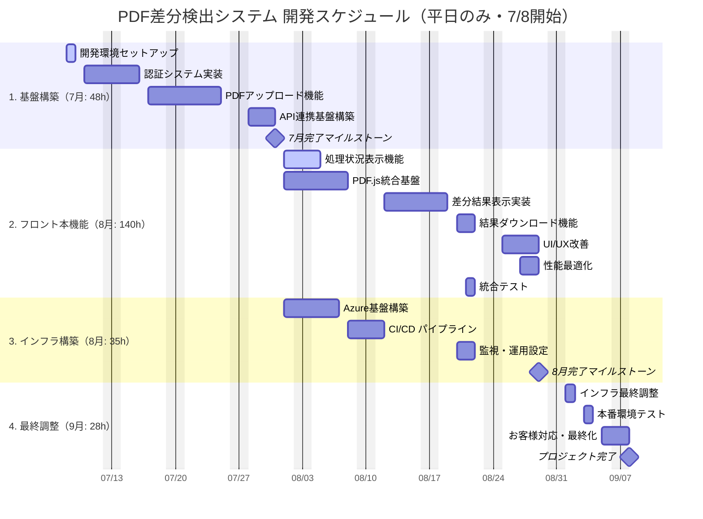

# PDF差分検出システム - WBS & ガントチャート

## 文書概要

| 項目 | 詳細 |
|------|------|
| 作成日 | 2025年7月4日 |
| プロジェクト期間 | 2025年7月1日 - 2025年9月10日 |
| 総工数 | 216時間（1.35人月） |
| 担当者 | 杉山さん（フロントエンド・インフラ） |

## WBS（Work Breakdown Structure）

### 1. プロジェクト基盤構築（7月: 48時間）

#### 1.1 開発環境セットアップ（8時間）
- 1.1.1 Next.js 15 + TypeScript プロジェクト初期化（2時間）
- 1.1.2 依存関係設定（Tailwind CSS, Zustand, PDF.js）（3時間）
- 1.1.3 開発ツール設定（ESLint, Prettier）（2時間）
- 1.1.4 基本ディレクトリ構造構築（1時間）

#### 1.2 認証システム実装（15時間）
- 1.2.1 JWT認証機能実装（5時間）
- 1.2.2 ログイン/ログアウト UI作成（4時間）
- 1.2.3 認証状態管理（Zustand）（3時間）
- 1.2.4 保護されたルート設定（3時間）

#### 1.3 PDFアップロード機能（15時間）
- 1.3.1 ファイルアップロード UI（6時間）
- 1.3.2 ドラッグ&ドロップ機能（4時間）
- 1.3.3 ファイル形式検証（3時間）
- 1.3.4 プログレス表示（2時間）

#### 1.4 API連携基盤構築（10時間）
- 1.4.1 HTTP クライアント設定（3時間）
- 1.4.2 バックエンドAPI接続設定（4時間）
- 1.4.3 エラーハンドリング基盤（2時間）
- 1.4.4 基本レイアウト・ナビゲーション（1時間）

### 2. フロントエンド本機能実装（8月1-3週: 105時間）

#### 2.1 処理状況表示機能（8月第1週: 15時間）
- 2.1.1 リアルタイム進捗表示（5時間）
- 2.1.2 WebSocket/ポーリング実装（6時間）
- 2.1.3 エラー状態ハンドリング（2時間）
- 2.1.4 処理状況UI実装（2時間）

#### 2.2 PDF.js統合・差分表示（8月第1-2週: 35時間）
- 2.2.1 PDF.js ライブラリ統合（8時間）
- 2.2.2 PDF表示コンポーネント作成（7時間）
- 2.2.3 差分ハイライト機能（12時間）
- 2.2.4 サイドバイサイド比較表示（8時間）

#### 2.3 結果ダウンロード機能（8月第3週: 15時間）
- 2.3.1 注釈付きPDFダウンロード（6時間）
- 2.3.2 差分レポート生成（5時間）
- 2.3.3 複数形式エクスポート（4時間）

#### 2.4 UI/UX改善（8月第4週: 20時間）
- 2.4.1 アクセシビリティ対応（5時間）
- 2.4.2 エラーメッセージ改善（3時間）
- 2.4.3 レスポンシブデザイン（7時間）
- 2.4.4 ローディング状態最適化（5時間）

#### 2.5 性能最適化（8月第4週: 10時間）
- 2.5.1 PDF表示パフォーマンス調整（4時間）
- 2.5.2 API レスポンス最適化（3時間）
- 2.5.3 フロントエンド バンドル最適化（3時間）

#### 2.6 統合テスト（8月第3週: 10時間）
- 2.6.1 E2Eテスト実装（4時間）
- 2.6.2 API連携テスト（3時間）
- 2.6.3 基本性能テスト（3時間）

### 3. インフラ構築・DevOps（8月: 35時間）

#### 3.1 Azure基盤構築（8月第1-2週: 15時間）
- 3.1.1 Azure Container Registry設定（3時間）
- 3.1.2 Container Instances設定（5時間）
- 3.1.3 Azure Database for PostgreSQL設定（4時間）
- 3.1.4 ネットワーク・セキュリティ設定（3時間）

#### 3.2 CI/CDパイプライン（8月第2週: 10時間）
- 3.2.1 GitHub Actions設定（4時間）
- 3.2.2 Docker image build/push（3時間）
- 3.2.3 自動デプロイメント設定（3時間）

#### 3.3 監視・運用設定（8月第3週: 10時間）
- 3.3.1 Application Insights設定（4時間）
- 3.3.2 Log Analytics設定（3時間）
- 3.3.3 アラート・ダッシュボード設定（3時間）

### 4. 最終調整・デプロイ（9月: 28時間）

#### 4.1 インフラ最終調整（9月第1週: 10時間）
- 4.1.1 Azure Front Door設定（4時間）
- 4.1.2 WAF・セキュリティ詳細設定（3時間）
- 4.1.3 スケーリング・バックアップ設定（3時間）

#### 4.2 本番環境テスト（9月第1週: 10時間）
- 4.2.1 本番環境での総合テスト（4時間）
- 4.2.2 負荷テスト実行（3時間）
- 4.2.3 セキュリティテスト（3時間）

#### 4.3 お客様対応・最終化（9月第2週: 8時間）
- 4.3.1 お客様デモ・レビュー実施（3時間）
- 4.3.2 フィードバック対応・最終調整（3時間）
- 4.3.3 運用マニュアル作成（2時間）

## Gantt Chart（Mermaid）

## クリティカルパス分析

### クリティカルパス
1. **API連携基盤構築** → **処理状況表示機能** → **差分結果表示実装** → **本番環境テスト** → **プロジェクト完了**

### 主要依存関係
- バックエンドAPI完成（7月31日）→ フロントエンド本機能実装開始
- PDF.js統合基盤 → 差分結果表示実装
- Azure基盤構築 → 本番環境テスト
- 統合テスト完了 → お客様デモ実施

## リソース配分グラフ

| 期間 | 工数/週 | 累積工数 | 主要アクティビティ |
|------|---------|----------|--------------------|
| 7月第1週 | 8時間 | 8時間 | 開発環境セットアップ |
| 7月第2週 | 10時間 | 18時間 | 認証システム実装 |
| 7月第3週 | 15時間 | 33時間 | PDFアップロード機能 |
| 7月第4週 | 15時間 | 48時間 | API連携基盤構築 |
| 8月第1週 | 35時間 | 83時間 | 処理状況表示・PDF.js統合 |
| 8月第2週 | 35時間 | 118時間 | 差分表示・CI/CD構築 |
| 8月第3週 | 35時間 | 153時間 | ダウンロード機能・監視設定 |
| 8月第4週 | 35時間 | 188時間 | UI/UX改善・性能最適化 |
| 9月第1週 | 20時間 | 208時間 | インフラ調整・本番テスト |
| 9月第2週 | 8時間 | 216時間 | お客様対応・最終化 |

## マイルストーン（修正版）

| 日付 | マイルストーン | 成果物 | 工数消費 |
|------|---------------|--------|----------|
| 7月31日 | Phase 1完了 | 認証・アップロード機能、API連携基盤 | 48時間 |
| 8月29日 | Phase 2&3完了 | フル機能実装、インフラ構築完了 | 140時間 |
| 9月8日 | プロジェクト完了 | 本番稼働開始 | 28時間 |

## リスク要因とバッファ

### 高リスクタスク
- **PDF.js統合・差分表示実装**（35時間）- 技術的複雑性
- **Azure基盤構築**（15時間）- 初回構築リスク
- **統合テスト**（10時間）- 予期しない問題発見

### バッファ戦略
- 各フェーズに20%のバッファを内包
- 9月第2週を最終調整期間として確保
- クリティカルパスタスクの優先実行